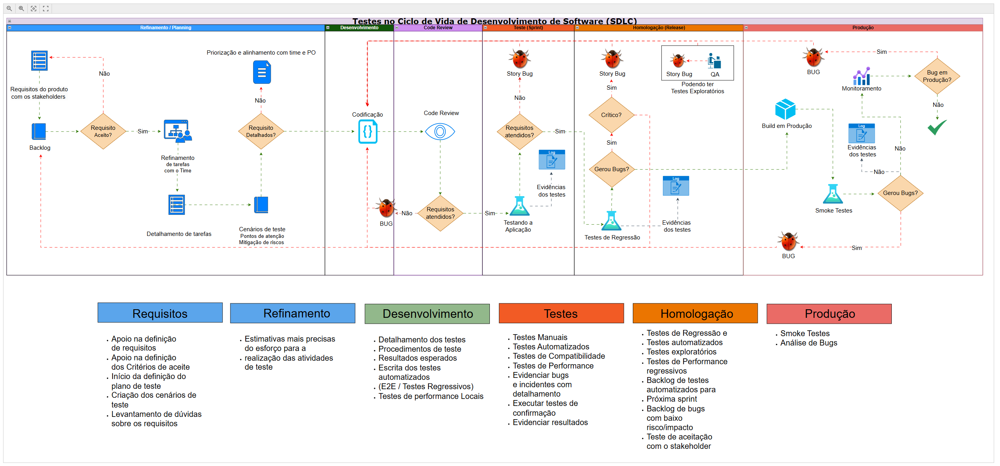

# Testes no Ciclo de Vida de Desenvolvimento de Software (SDLC) 

  

## Descrição do Projeto

Este repositório documenta um fluxograma detalhado que representa os principais pontos de atuação do QA durante o Ciclo de Vida de Desenvolvimento de Software (SDLC). O objetivo do fluxo é guiar o processo de qualidade, desde o planejamento até a produção, visando garantir que os requisitos sejam atendidos, minimizar o surgimento de bugs e assegurar que a entrega final mantenha um alto padrão de qualidade.

## Fluxo do Ciclo de Vida de Desenvolvimento de Software

O fluxograma do SDLC está dividido em várias etapas, cada uma com atividades específicas e pontos de controle de qualidade. Abaixo, detalhamos cada uma dessas etapas:

### 1. Refinamento / Planejamento

- **Requisitos do Produto com Stakeholders**: Os requisitos iniciais são definidos em conjunto com os stakeholders.
  
- **Aceitação de Requisitos**:
  - **Sim**: Se os requisitos são aceitos, a equipe avança para o **Refinamento de Tarefas com o Time**, onde há uma priorização e alinhamento dos itens com o Product Owner (PO).
  - **Não**: O requisito é enviado de volta para o backlog para revisões e ajustes necessários.

- **Refinamento de Tarefas com o Time**: Os requisitos aceitos são discutidos e detalhados, com foco nos critérios de aceitação e mitigação de riscos.

### 2. Desenvolvimento

- **Codificação**: Após o detalhamento, a equipe de desenvolvimento inicia a codificação dos requisitos.
  
- **Code Review**: O código desenvolvido passa por uma revisão para garantir que atende aos requisitos especificados.
  - **Requisitos Atendidos?**
    - **Sim**: O processo avança para a próxima fase de testes.
    - **Não**: Caso o código não atenda aos requisitos, ele é enviado de volta para ajustes na codificação.

### 3. Teste (Sprint)

- **Testando a Aplicação**: A aplicação é testada de acordo com os critérios de aceitação definidos.
  
- **Requisitos Atendidos?**
  - **Sim**: O processo avança para testes no ambiente de homologação e evidências dos testes são registradas.
  - **Não**: Bugs identificados nessa fase são registrados como **Story Bugs** e volta ao desenvolvimento, sendo revisado, entendido o que ocorreu e corrigido.

### 4. Homologação (Release)
- **Testes de regressão**: No ambiente de homologação são realizados após a correção de todos os bugs identificados na fase de testes. Esses testes têm como objetivo garantir que as correções realizadas e as novas implementações não tenham introduzido novos problemas ou afetado funcionalidades já existentes no sistema. Nessa fase, os testes são executados novamente sobre os mesmos cenários que foram previamente aprovados, para assegurar que o sistema continua funcionando conforme esperado. Isso ajuda a mitigar riscos e aumenta a confiança na estabilidade do software antes de seu lançamento em produção.

- **Story Bug**: Caso um bug seja identificado, ele passa por uma avaliação de criticidade.
  - **Crítico?**
    - **Sim**: O bug crítico leva e que afeta a funcionalidade, as regras de negócio ou impactou em alguma outra funcionalidade, ele é registrado e levado para a etapa de codificação. 
    - **Não**: Se não for crítico, geralmente é registrado no backlog, para futuramente ou numa próxima sprint ser refinado e corrigido.

- **Testes Exploratórios (opcional)**: O QA pode executar testes exploratórios para identificar possíveis problemas não cobertos nos testes anteriores. Geralmente são executados ao final de todas as correções dos Bugs, de forma rápida e pontual, para garantir que tudo está funcionando como deveria.

- **Evidências dos Testes**: As evidências dos testes realizados são registradas para documentar os resultados e rastrear problemas.

### 5. Produção

- **Build em Produção**: A aplicação é implantada no ambiente de produção.

- **Smoke Testes**: São executados para verificar se as principais funcionalidades da aplicação estão operando conforme esperado após o deploy.
  - **Gerou Bugs?**
    - **Sim**: Bugs identificados são corrigidos imediatamente.
    - **Não**: A aplicação é aprovada para uso em produção.
      
- **Monitoramento**: A aplicação é monitorada para identificar possíveis bugs e verificar a estabilidade da aplicação.
  
- **Bug em Produção?**
  - **Sim**: Caso um bug seja identificado, ele é registrado para correção ou corrigido de forma imediata.
  - **Não**: A aplicação continua em produção sem problemas aparentes.

## Visualização do Fluxograma

- Para uma visualização detalhada do fluxograma animado, acesse o [fluxograma completo em HTML](https://quintilianonery.github.io/TestesNoSDLC/fluxograma_animado.html).
---

- **Este fluxo foi desenhado para assegurar que o QA participe ativamente em todas as fases do ciclo de desenvolvimento, promovendo a qualidade desde o planejamento até o monitoramento em produção.**
